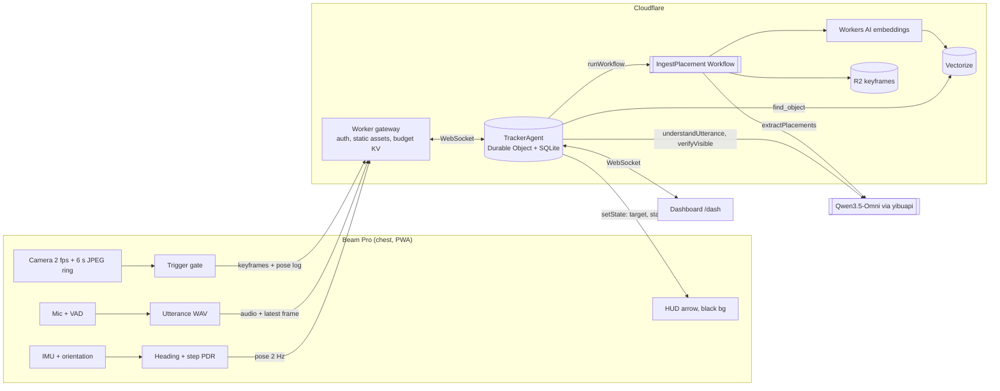

# Architecture

## Where the "agent with a brain" lives

`TrackerAgent` (one Durable Object per device):

- **State** (`setState`, synced to the PWA and the dashboard): pose, target, status, last reply, budget.
- **Memory** (SQLite): `objects`, `sightings`, `zones`, `pose_log`, `traces`, plus short multi-turn context for clarifying questions.
- **Tools**: `find_object`, `guide_to`, `verify_visible`, `list_recent`, `mark_moved`, `forget`, `clarify`.
- **Planning loop**: at most 4 OMNI steps per utterance, each step is a tool call or a final answer; every step is written to `traces` and streamed to the dashboard.
- **Workflows**: `IngestPlacementWorkflow` is durable and retried (OMNI extraction, embedding, reconcile, upsert).
- **Scheduling**: `schedule()` runs retention purge and optional "still there?" re-verification.

## Latency path for a spoken query

`arrow first, voice second`: `guide_to` calls `setState` immediately, so the HUD arrow appears as soon as the tool runs, before the final answer is synthesized.
