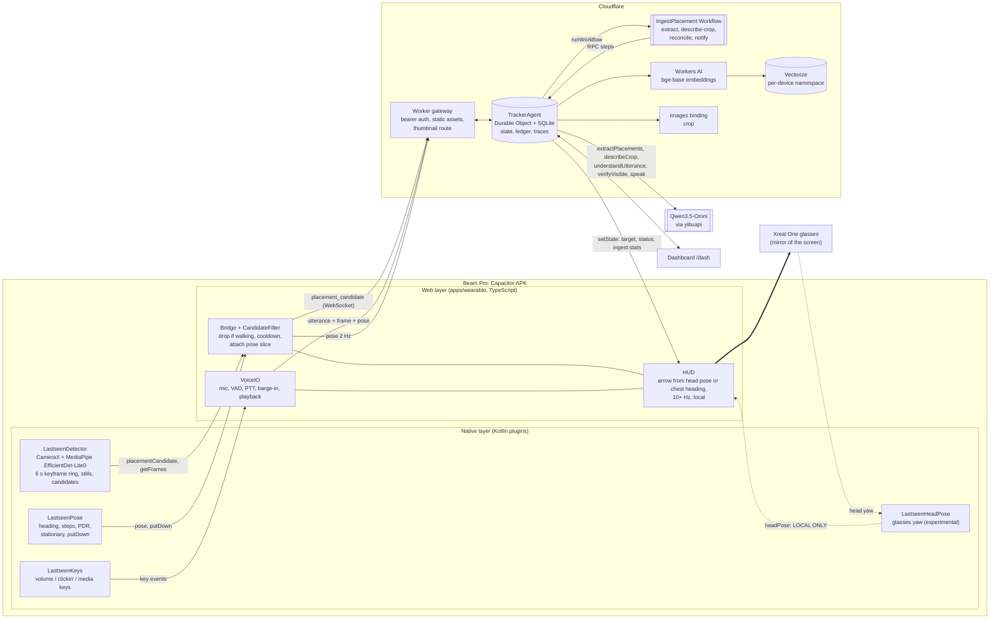

# Architecture

Lastseen is a wearable memory for objects. A Xreal Beam Pro is strapped to the chest (portrait, upright, screen against the
chest, rear camera facing forward) and runs a **Capacitor Android APK**. The Xreal One glasses mirror the phone screen and show
the HUD. When the wearer puts something down the system logs what and where; later they ask out loud and the glasses show an
arrow while a voice answers.

## Layers and who owns what

| Layer | Code | Owner |
| --- | --- | --- |
| Native (camera, detection, sensors, glasses, keys) | Kotlin Capacitor plugins, spec in [NATIVE_CONTRACT.md](NATIVE_CONTRACT.md) | teammates |
| Web layer | `apps/wearable` (TypeScript, Vite) | this repo |
| Contract | `packages/shared` (zod schemas, geometry, v1/v2 compat, native payload schemas) | this repo |
| Backend | `apps/worker` (Worker gateway, `TrackerAgent`, Workflow, OMNI adapter) | this repo |
| Dashboard | `apps/dashboard` | this repo |
| Simulator | `tools/sim` (drives the real `Bridge`/`CandidateFilter` with mock plugins over the real WebSocket) | this repo |

## Ingest path (a placement becomes a ledger row)

1. **Native detector** watches the scene at ~2 fps on the phone. When an object appears and the scene settles for 800 ms it emits
   `placementCandidate` with up to 6 keyframes (640 px JPEG), the detector boxes for each, optionally one full-res still.
   Detection is on the phone: no frames leave the device until a candidate exists.
2. **Web layer** (`CandidateFilter`) drops it if the wearer was walking in `[t-1.5 s, t+0.5 s]` (using the local pose ring buffer),
   applies a 4 s cooldown, then attaches the pose slice and `hfovDeg`. Backup triggers (narration key, dashboard remote button,
   `putDown`) pull the same kind of payload from the native ring buffer via `getFrames()` + `captureStill()`.
3. **Agent guards** (cheapest first, nothing calls OMNI): no image bytes -> `no_image`; mostly non-stationary pose slice ->
   `walking` (voice/manual/put_down are exempt); frame hash within 4 bits of one of the last 10 -> `duplicate`; within 4 s of the
   last accepted candidate -> `cooldown`; already 6 OMNI vision calls this minute -> `rate_limit`. Every drop writes a trace with
   the reason and bumps the counters shown on the dashboard.
4. **Workflow** (durable, retried): `extract` sends OMNI the frames plus a compact text list of the detector boxes of the final
   frame and asks *which detection index is the newly placed object, or null?* (plus label, description, zone). If detections are
   missing and `DETECTOR_URL` is set, a remote detector is tried first (2 s timeout, shared secret; failure never blocks).
   `describe-crop` crops the chosen box (plus margin) from the full-res still with the Images binding and asks OMNI to describe
   just that crop. `reconcile` positions the object, decides same-object-or-new, writes the sighting, upserts the vector.
   `notify` pushes the ledger to the dashboards.
5. **Position** = pose at the frame time + `d * (sin(h + phi), cos(h + phi))`, `phi = (bboxCenterX - 0.5) * hfov`. The box is the
   detector box OMNI chose; else OMNI's own box; else none (straight ahead, low confidence).

## Query path (asking "where are my keys?")

`VoiceIO` (audio-only `getUserMedia` in the WebView, behind an interface so it can move native) produces a 16 kHz WAV via VAD or
push-to-talk (hardware keys, dashboard remote). The phone sends `utterance{turnId, audio, latest frame, poseAtT}`. The agent runs at most 4 OMNI steps
(tool call or final answer, strict JSON protocol), calling `find_object`, `guide_to`, `verify_visible`, `list_recent`,
`mark_moved`, `forget`, `clarify`, `recenter`. **`guide_to` calls `setState` immediately: arrow first, voice second.** A new utterance
or a barge-in sends `cancel{turnId}` and playback stops on the phone.

## HUD arrow

`arrowAngle(target, pose, headPose?, headOffsetDeg)`: `headHeading` is the glasses yaw plus offset when the head pose is fresh
(< 300 ms), else the chest heading; `angle = wrap180(bearingToTarget - headHeading)`. Computed on the phone at 20 Hz with a
low-pass filter, so head turns feel instant and never wait for the network. Head pose never leaves the phone.

## Where the "agent with a brain" lives

`TrackerAgent` (one Durable Object per device): **state** (`setState`, synced to every client), **memory** (SQLite: objects,
sightings, zones, pose ring buffer, traces, candidates), **tools**, a **planning loop** (max 4 steps, every step traced),
**Workflows** for durable ingest, **`schedule()`** for retention purge (`scheduleEvery(600, "purgeExpired")`).

## Privacy

Detection runs on the phone. Frames leave the device only for a candidate, at most 6 at 640 px (plus one bounded still). After
reconcile the agent keeps **only the frame that became the thumbnail** and deletes the other keyframes and any narration audio.
Ledger rows, thumbnails and vectors expire after `RETENTION_HOURS`. "Forget everything" and "forget the keys" delete rows,
thumbnails and vectors. Connections are bearer-authenticated; a recording indicator is always visible on the HUD.
