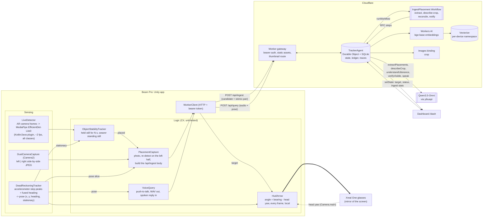

# Architecture

Lastseen is a wearable memory for objects. A Xreal Beam Pro is strapped to the chest (portrait, upright, screen against the
chest, rear camera facing forward) and runs a **Unity Android app** (`Assets/Scripts/Lastseen` + `LastseenApp`). The Xreal One glasses mirror the phone screen and show
the HUD. When the wearer puts something down the system logs what and where; later they ask out loud and the glasses show an
arrow while a voice answers.

## Layers and who owns what

| Layer | Code | Notes |
| --- | --- | --- |
| Unity client (sensing, dead reckoning, capture, voice, HUD) | `../Assets/Scripts/Lastseen` (pure C#, unit-tested) and `LastseenApp` (MonoBehaviours), plus the teammates' `Forgetmenot` (MediaPipe bridge) and `DualCameraCapture` | see [unity-client.md](unity-client.md) |
| Contract | `packages/shared` (zod schemas, geometry, v1/v2 compat, `test-vectors/geometry.json`) | TypeScript is the reference; C# replays the vectors |
| Backend | `apps/worker` (Worker gateway, `TrackerAgent`, Workflow, OMNI adapter, stereo depth, HTTP API) | |
| Dashboard | `apps/dashboard` | live view of ledger, traces, budget |
| Simulator | `tools/sim` + `apps/wearable` (the old TypeScript wearer layer: real `Bridge`/`CandidateFilter` with mock plugins over the real WebSocket) | regression harness for the backend; not the product client |
| Hardware probes | `apps/probe` (plain Android app) + `scripts/android.mjs` | camera exclusivity, concurrent cameras, sensors, FOV: answers what the Unity client can rely on |

## Ingest path (a placement becomes a ledger row)

1. **On the phone**, `LiveDetector` runs MediaPipe at ~2 fps on the AR camera feed. `ObjectStabilityTracker` fires when a detection has held
   roughly the same place for ~3.5 s **while the wearer stands still** (screen positions mean nothing while the chest-mounted camera moves;
   every track is dropped the moment the wearer steps). No frames leave the device until then.
2. **`PlacementCapture`** takes the dual-camera photo (left | right side by side), cuts out the left half as the keyframe, re-runs the detector on
   it (so the boxes match the image the depth is measured on), and POSTs `/api/ingest` with the pose slice around that moment, `hfovDeg`, the
   boxes and the whole side-by-side JPEG as `stereo`. A manual "Log what's in front of me" button sends the same thing with trigger `manual`.
   (The TypeScript `CandidateFilter`, walking filter and 4 s cooldown live on in `apps/wearable` for the simulator; the Worker enforces
   the same guards in step 3, so the Unity client does not depend on them.)
3. **Agent guards** (cheapest first, nothing calls OMNI): no image bytes -> `no_image`; mostly non-stationary pose slice ->
   `walking` (voice/manual/put_down are exempt); frame hash within 4 bits of one of the last 10 -> `duplicate`; within 4 s of the
   last accepted candidate -> `cooldown`; already 6 OMNI vision calls this minute -> `rate_limit`. Every drop writes a trace with
   the reason and bumps the counters shown on the dashboard.
4. **Workflow** (durable, retried): `extract` sends OMNI the frames plus a compact text list of the detector boxes of the final
   frame and asks *which detection index is the newly placed object, or null?* (plus label, description, zone). If detections are
   missing and `DETECTOR_URL` is set, a remote detector is tried first (2 s timeout, shared secret; failure never blocks).
   `describe-crop` crops the chosen box (plus margin) from the full-res still with the Images binding and asks OMNI to describe
   just that crop. `reconcile` positions the object, decides same-object-or-new, writes the sighting, upserts the vector.
   `notify` pushes the ledger to the dashboards.
5. **Position.** The box is the detector box OMNI chose; else OMNI's own box; else none (straight ahead, low confidence).
   - **Stereo (preferred):** when the candidate carries a `stereo` pair and there is a box, `ingest/stereo.ts` block-matches the centre patch of the
     box between the two halves. `depth = fx * baseline / disparity` (`fx` from the half-image FOV; baseline `STEREO_BASELINE_M`, default 0.06 m,
     a placeholder until measured). The pinhole model (`objectPositionFromDepth`) turns pixel + depth + heading into `x, y` and a height relative
     to the camera. A flat or repetitive patch (`ambiguous`), an implied depth beyond 8 m, or a box at the image edge falls back to:
   - **OMNI's distance estimate:** `d` clipped to 0.3-3 m along `phi = (bboxCenterX - 0.5) * hfov`; a missing estimate means 0.8 m.
   Every ledger row records how it was positioned (`posSource`: `stereo` | `omni` | `default`) and, for stereo, its height (`heightM`); the trace
   shows the depth, disparity and match ratio. The stereo pair is deleted after reconcile, like the other keyframes.

## HTTP API (the Unity client; same agent, guards and memory as the WebSocket)

| Route | Body | Reply |
| --- | --- | --- |
| `POST /api/ingest[?wait=1]` | a placement candidate (contract v2, no `type`), optional `stereo: {jpegBase64, baselineM?, swap?}` | `{accepted, candidateId, status, objects[]}` or `{accepted:false, reason}`; `wait=1` holds up to 25 s until the object is logged |
| `POST /api/query` | `{text \| audioB64+mime, poseAtT?, frame?}` | `{turnId, addressed, text, audioB64?, mime?, target}`: the spoken answer and the HUD target this turn set |
| `GET /api/memory` | | objects, pose, target, ingest stats, budget, recent traces: what the agent currently remembers |

All take `?device=<id>` (default `default`) and the bearer token. HTTP has no socket to answer a `request_frame`, so a `frame` in the query body
stands in for the live view when the agent calls `verify_visible`; without one that tool reports "inconclusive".

## Query path (asking "where are my keys?")

`VoiceIO` (audio-only `getUserMedia` in the WebView, behind an interface so it can move native) produces a 16 kHz WAV via VAD or
push-to-talk (hardware keys, dashboard remote). The phone sends `utterance{turnId, audio, latest frame, poseAtT}`. The agent runs at most 4 OMNI steps
(tool call or final answer, strict JSON protocol), calling `find_object`, `guide_to`, `verify_visible`, `list_recent`,
`mark_moved`, `forget`, `clarify`, `recenter`. **`guide_to` calls `setState` immediately: arrow first, voice second.** A new utterance
or a barge-in sends `cancel{turnId}` and playback stops on the phone.

## HUD arrow

`arrowAngle(target, pose, headPose?, headOffsetDeg)`: `headHeading` is the glasses yaw plus offset when the head pose is fresh
(< 300 ms), else the chest heading; `angle = wrap180(bearingToTarget - headHeading)`. Computed on the phone at 20 Hz with a
low-pass filter, so head turns feel instant and never wait for the network. Head pose never leaves the phone.

## Where the "agent with a brain" lives

`TrackerAgent` (one Durable Object per device): **state** (`setState`, synced to every client), **memory** (SQLite: objects,
sightings, zones, pose ring buffer, traces, candidates), **tools**, a **planning loop** (max 4 steps, every step traced),
**Workflows** for durable ingest, **`schedule()`** for retention purge (`scheduleEvery(600, "purgeExpired")`).

## Privacy

Detection runs on the phone. Frames leave the device only for a candidate, at most 6 at 640 px (plus one bounded still). After
reconcile the agent keeps **only the frame that became the thumbnail** and deletes the other keyframes and any narration audio.
Ledger rows, thumbnails and vectors expire after `RETENTION_HOURS`. "Forget everything" and "forget the keys" delete rows,
thumbnails and vectors. Connections are bearer-authenticated; a recording indicator is always visible on the HUD.
